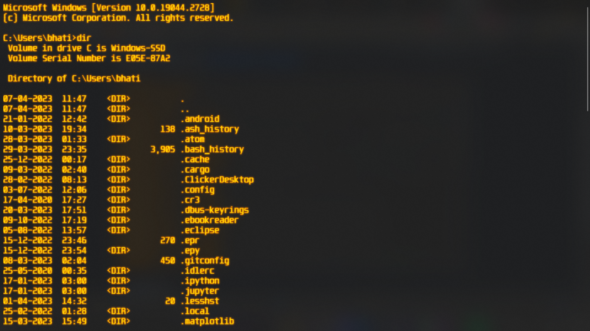

# Amber-theme for [Windows Terminal](https://github.com/Microsoft/Terminal)

# Installation

* To install, copy-paste the contents of `scheme.json` into the `schemes` section of your Windows Terminal
settings, `Ctrl + ,` to open them.
* Add/Modify `"colorScheme": "Amber-theme"` in respective profile to activate.
* In Settings, go into 'Command Prompt' > 'Appearence' > 'Retro Terminal Effects' and switch it to 'On'.
* For best results, set the `Font face` to `Unispace` and set the `Font size` to `16`.
